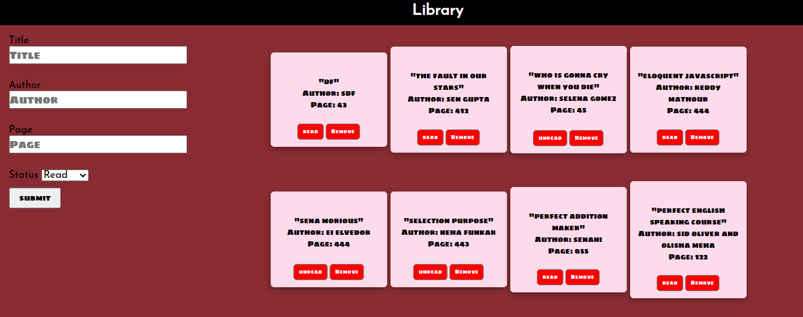

# Odin project- Library App solution

This is a solution to the [Odin project Library App solution](https://www.theodinproject.com/paths/full-stack-javascript/courses/javascript/lessons/library). The Odin projects help you become a web developer with zero dollar investment.
## Table of contents

- [Overview](#overview)
  - [The challenge](#the-challenge)
  - [Screenshot](#screenshot)
  - [Links](#links)
- [My process](#my-process)
  - [Built with](#built-with)
  - [What I learned](#what-i-learned)
  - [Continued development](#continued-development)
  - [Useful resources](#useful-resources)
- [Author](#author)
- [Acknowledgments](#acknowledgments)


## Overview

### The challenge

Users should be able to:

- Add books they are reading or plan to read in future
- Remove books 
- change the status of a book to 'read' or 'unread'
- save their data on local storage

### Screenshot



### Links

- Solution URL: [solution](https://github.com/sidoliver/Library)
- Live Site URL: [Live](https://sidoliver.github.io/Library/)


### Built with

- Semantic HTML5 markup
- CSS custom properties
- Flexbox
- Vanilla Javascript
- ES6 classes
- Mobile-first workflow


### What I learned

I made this project Twice. First I build this app using object constructor and then I build it using ES6 classes.

Building with object constructor is little bit messy. There are two ways we can create object-
1.Object Literal
2.Object constructor
  Object constructor is handy as compared to object. Javascript is not a class dependent langauge. It is a protoype dependent language. So I learned about prototype and protype Inheritance, Which helped me to understand classes in a much better manner.
     Classes are just a blueprint or templates for javascript objects. We can structure our code in an efficient manner using classes.
 - Through this project I learnd about storing website data in local storage and syntax like getItem(), setItem() and localStorage.clear()


```Javascript class
class ClassMates{
	constructor(name,age){
    	this.name=name;
      	this.age=age;
    }
  	displayInfo(){
    	return this.name + "is " + this.age + " years old!";
    }
}

let classmate = new ClassMates("Mike Will",15);
```

```Javascript Object constructor
 let Classmates = function(name,age) {
     this.name = name;
     this.age = age;
     this.displayInfo() {
         return this.name + 'is ' + this.age + ' years old!';
     }
 }
 
```


### Useful resources

- [Object constructor and inheritance](https://web.archive.org/web/20200513181548/https://javascriptissexy.com/javascript-prototype-in-plain-detailed-language/) - This helped me for knowing protype-based inheritance and the prototype chain.
- [Prototypal Inheritance](https://www.theodinproject.com/paths/full-stack-javascript/courses/javascript/lessons/objects-and-object-constructors) - This is an amazing article which helped me finally understand prototypal Inheritance. I'd recommend it to anyone still learning this concept.


## Author


- LinkedIn - [@giridhariraita](https://www.linkedin.com/in/giridhari-raita-25696011b/)
- Twitter - [@giridhariraita](https://twitter.com/giridhariraita)


## Acknowledgments

I am thankful to the Odin project team for building such an amazing platform, where anyone can learn to code for free. Only dedication matters.
